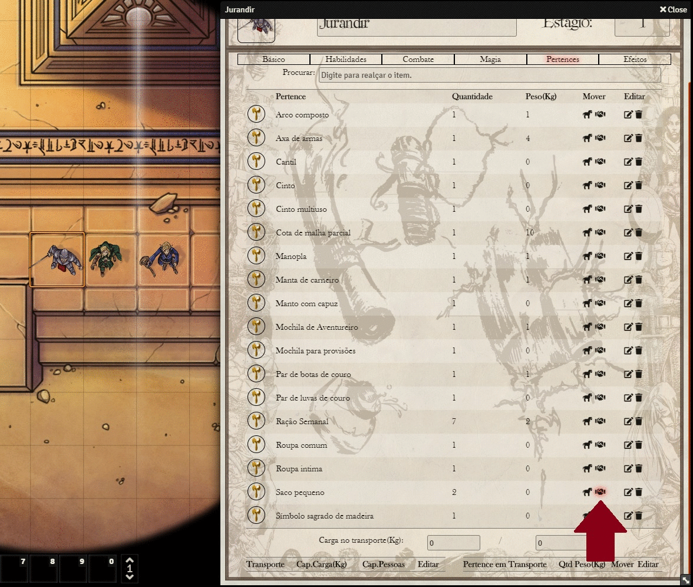

# Tagmar Transações
## Módulo para sistema Tagmar RPG no Foundry Vtt
Com esse módulo é possível que os jogadores troquem pertences entre si. Para usar basta instalar o módulo pelo link do manifest (https://raw.githubusercontent.com/marcoswalker/tagmartrade/master/module.json), depois basta ativar o mesmo. Quando ativo um novo ícone aparece na ficha de personagem na parte de Pertences. Só pode ser usado por jogadores que se encontram online, e apenas o personagem principal receberá os pertences, não funciona com Mestre de Jogo. Módulo inspirado pelo [Give item to another player](https://foundryvtt.com/packages/give-item), que só funciona com o DnD5e.

